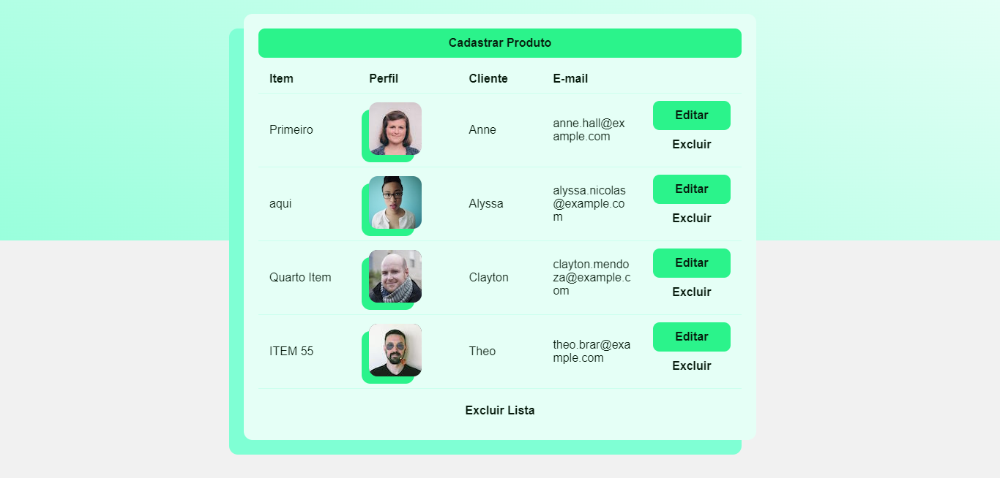
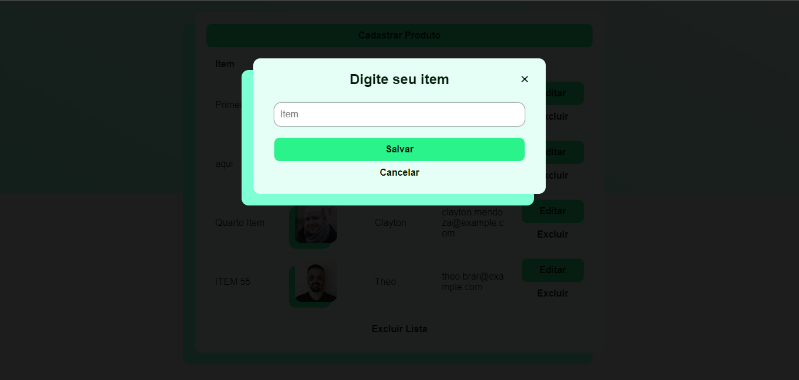

# ​💻 Projeto Técnico Simbiose

O desafio possuia os seguintes requisitos:

Nesta lista devem existir as seguintes funcionalidades: Inserir um item, editar um item, excluir um item, excluir todos os itens e listar todos os itens.
Para cada item inserido na lista deve ser exibida o nome e email aleatorios de quem ficará responsável por comprar o item. Para recuperar o nome e email utilizar a api.

### Tecnologia

- HTML5
- React JS
-- Fetch API
-- Styled Components

## João Kax
Developer
